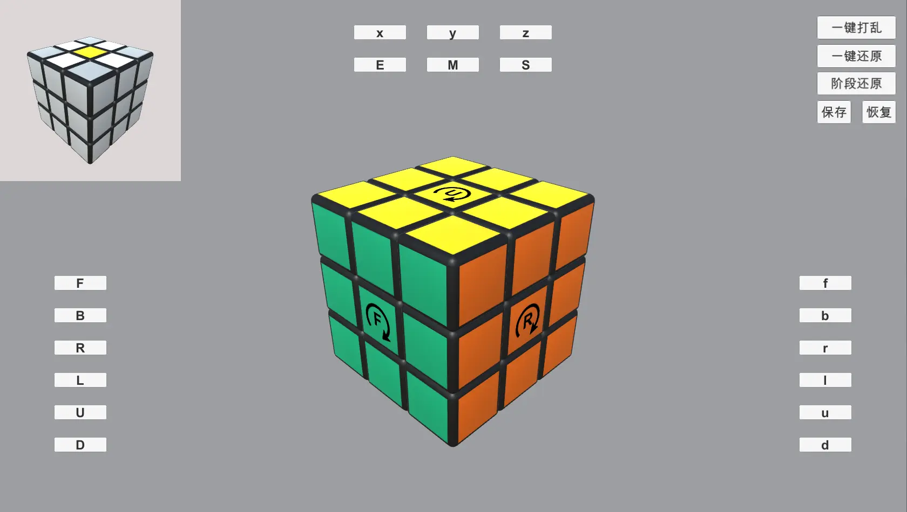

# 智能魔方

#### 介绍
用Unity开发魔方小游戏

Unity软件架构
软件架构说明

#### 安装教程

1.  
2.  xxxx
3.  xxxx

魔方游戏使用说明

观察：
按键盘上的左边的alt键加鼠标移动360无死角观察游戏魔方，按键盘上的v键可用移动鼠标360无死角观察目标魔方

中心转动符：
魔方中心块加了转动提示符，提示魔方是须时针转还是逆时针旋转，双击转动提示符可快速将其设为F面

魔方转动方向切换：
魔方默认为须时针转动，按键盘上的ctrl键，可切换魔方的转动类型和提示符类型为逆时针旋转

魔方状态：
点击保存可以保存一个魔方记忆点，按魔方状态还原就可复原到上一个魔方记忆点。

魔方打乱：
随机打乱魔方

魔方还原算法：
模拟cfop公式的算法，分为五个阶段还原：
白色小黄花，
白色底部十字架，
白色底部两层，
白色底部两层和黄色顶层翻色，
白色底部两层和黄色顶层翻色和黄色顶层顺序调整

#### 参与贡献

1.  Fork 本仓库
2.  新建 Feat_xxx 分支
3.  提交代码
4.  新建 Pull Request

#### 特技

1.  使用 Readme\_XXX.md 来支持不同的语言，例如 Readme\_en.md, Readme\_zh.md
2.  Gitee 官方博客 [blog.gitee.com](https://blog.gitee.com)
3.  你可以 [https://gitee.com/explore](https://gitee.com/explore) 这个地址来了解 Gitee 上的优秀开源项目
4.  [GVP](https://gitee.com/gvp) 全称是 Gitee 最有价值开源项目，是综合评定出的优秀开源项目
5.  Gitee 官方提供的使用手册 [https://gitee.com/help](https://gitee.com/help)
6.  Gitee 封面人物是一档用来展示 Gitee 会员风采的栏目 [https://gitee.com/gitee-stars/](https://gitee.com/gitee-stars/)
